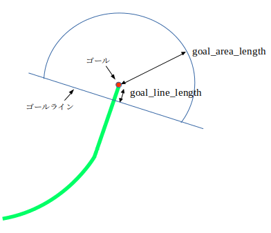

tmc_base_path_follower
===============================================================================

概要
-------------------------------

X-Y平面上を移動することができる台車ロボットに対し移動経路が与えられたとき、  
自身の自己位置を参照し、経路に追従するようなロボットの台車指令速度を計算し出版する。

ノードの振る舞い
--------------------------------

移動経路をpath_follow_actionアクションで受け取る。~pathトピックで受け取ることもできる。  
自己位置情報である/global_poseトピックを購読し、ロボット移動速度指令値/base_velocityトピックを生成し出版する。  
自己位置情報が途絶したらアクションはABORTEDを返し、経路追従中であった場合は停止する。途絶を判断する時間閾値はパラメータで指定できる。  

ロボット移動速度指令値は、経路と自己位置のずれ量を補正しつつ、経路に追従するような速度とする。  
ゴールに到着したら停止しアクション完了する。  

入力経路は2点以上を含む必要がある。  
2点未満の経路が入力された場合、アクションはABORTEDを返し、経路追従中であった場合は停止する。  

use_path_transit_velocityパラメータで経路通過速度機能を有効にするか否かを選択できる。  
経路通過速度機能を有効にすれば、経路の形状に合わせた速度で走行させることが出来る。  
パラメータで指定した速度範囲の中で、カーブなど曲率が大きい部分は減速し、直線部分など曲率が小さい部分は加速する。  

全方位モデルと差動二輪モデルの二つの移動モデルを、move_model_nameパラメータで切り替えるとことができる。  
それぞれの速度モデルの振る舞いを以下に記す。  

全方位モデルの振る舞い
--------------------------------

全方位モデルでは、台車中心のxy成分の並進速度指令と、yaw成分の回転速度指令を独立に指令することができ、  
台車の位置xyを経路に追従させつつ、任意の上体の姿勢を取らせることができる。  
ロボットとゴールを結ぶ経路長が、omni_velocity_calculator/path_length_thresholdパラメータ以上の時は  
台車の上体を経路中の最寄り点の向きと同じとなるように制御し、  
omni_velocity_calculator/path_length_thresholdパラメータ未満の時は  
台車の上体を経路のゴールの向きに徐々に合わせていくように制御する。  

ゴール付近ではゴールまでの距離に比例して徐々に減速する。  
ゴールからの距離がomni_goal_checker/goal_area_lengthパラメータで指定した範囲内かつ、  
omni_goal_checker/goal_line_lengthパラメータで指定した位置に引いたゴールラインよりもゴール側に入ればゴールエリアに入ったと判断する。  

ゴールエリアに入ったら、ゴール姿勢に合わせる速度を出版し、  
ゴールに対する位置偏差、角度偏差ともに閾値内となったらゴールに到達とする。  

差動二輪モデルの振る舞い
--------------------------------

差動二輪モデルでは、経路の向きに対して台車の向きが一定以上ずれている場合はその場で旋回して経路の向きにあわせてから並進移動をする。  
台車中心のx成分の並進速度指令と、yaw成分の回転速度指令を独立に指令することができる。y成分は常に0を出力する。  
x成分により進行速度を制御する。  
経路の曲率と、経路と自己位置のずれ量に応じてyaw成分を制御することで、経路からのずれを補正し経路に追従させながら走行する。  

ゴール付近ではゴールまでの距離に比例して徐々に減速する。  
ゴールエリアの判定は全方位モデルと同じ。  
ゴールエリアに入ったら、その場で停止し、その場旋回してゴールの向きにあわせる。  
ゴールに対する角度偏差が閾値内となったらゴールに到達とする。  

開発者
----------------------------

- 田中　和仁(kazuhito_tanaka@mail.toyota.co.jp)

### ROSインターフェース

#### 提供アクション
- /path_follow_action (tmc_base_path_follower/PathFollowerAction) : 経路追従アクション
   - goal:
      - nav_msgs/Path path : 追従経路
   - result:
      - 無し
   - feedback:
      - float64 progress : 経路追従進捗率(0.0-1.0)

#### 出版するトピック
- /base_velocity (geometry_msgs/Twist) : 移動速度指令値(並進速度[m/s]、旋回速度[rad/s])

#### 購読するトピック
- /global_pose (geometry_msgs/PoseStamped) : 自己位置

- ~path (nav_msgs/Path) : 追従経路

パラメータ
-------------------------------------------------------------------------------
    ~global_pose_timeout (double) : 自己位置トピックが途絶したと判断する時間[s]。途絶したらアクションはABORTEDを返し、経路追従中であった場合は停止する (default : 1.0)  
    ~move_model_name (string) : 移動モデル。全方位モデルは"omni"、差動二輪モデルは"diff_drive"を指定する (default : "omni")  
    ~use_path_transit_velocity(bool) : 経路通過速度による制限を行うか否か (default : false)  

    ~omni_velocity_calculator : 全方位モデル速度計算クラスパラメータ群  
      max_linear_velocity(double) : 最大並進速度[m/s] (default : 0.6)  
      max_angular_velocity(double) : 最大旋回速度[rad/s] (default : 0.8)  
      max_linear_acceleration(double) : 最大並進加速度[m/s^2] (default : 1.0)  
      max_angular_acceleration(double) : 最大旋回加速度[rad/s^2] (default : 1.0)  
      linear_deceleration_near_goal(double) : ゴール付近並進減速度 (default : 0.3)
                                              ゴール付近の速度 = linear_velocity_margin + ゴールまでの距離 * linear_deceleration_near_goal  
      linear_velocity_margin(double) : 並進最低速度マージン[m/s] (default : 0.05)  
      path_length_threshold(double) : 上体の向け方を変えるゴールまでの経路長閾値[m] (default : 2.0)  
      linear_p_gain(double) : 並進速度P制御ゲインパラメータ (default : 0.5)  
      angular_p_gain(double) : 回転速度P制御ゲインパラメータ (default : 0.5)  
      goal_angle_gain(double) : ゴール姿勢合わせゲインパラメータ (default : 0.5)  

    ~diff_drive_velocity_calculator : 差動二輪モデル速度計算クラスパラメータ群  
      max_linear_velocity(double) : 最大並進速度[m/s] (default : 0.6)  
      max_angular_velocity(double) : 最大旋回速度[rad/s] (default : 0.8)  
      max_linear_acceleration(double) : 最大並進加速度[m/s^2] (default : 1.0)  
      max_angular_acceleration(double) : 最大旋回加速度[rad/s^2] (default : 1.0)  
      linear_deceleration_near_goal(double) : ゴール付近並進減速度 (default : 0.3)
                                              ゴール付近の速度 = linear_velocity_margin + ゴールまでの距離 * linear_deceleration_near_goal  
      linear_velocity_margin(double) : 並進最低速度マージン[m/s] (default : 0.05)  
      linear_alpha_gain(double) : 並進速度αゲインパラメータ (default : 3.0)  
      linear_beta_gain(double) : 並進速度βゲインパラメータ (default : 1.5)  
      angle_error_angular_velocity_rate(double) : 角度誤差に対する回転速度の比率 (default : 1.0)  
      spin_start_error_angle(double) : その場旋回を開始する角度誤差 [rad] (default : 0.8)  
      spin_end_error_angle(double) : その場旋回を終了する角度誤差 [rad] (default : 0.03)  
      spin_max_angular_velocity(double) : その場旋回の最大旋回速度 [rad/s] (default : 2.0)  
      spin_min_angular_velocity(double) : その場旋回の最低旋回速度 [rad/s] (default : 0.05)  

    ~path_info_creator : 経路生成クラスパラメータ群  
      interpolation_number(int) : 経路補間で二点間の補間点数 (default : 10)  
      max_linear_velocity(double) : 最大並進速度[m/s] (default : 0.6)  

    ~omni_goal_checker : 全方位モデルゴール判定クラスパラメータ群  
      goal_area_length(double) : ゴールエリア判定距離[m] (default : 0.5)  
      goal_line_length(double) : ゴールエリア判定用ラインのゴールからの距離[m] (default : 0.05)  
      goal_stop_error_length(double) : ゴール判定用の位置偏差閾値[m] (default : 0.03)  
      goal_stop_error_angle(double) : ゴール判定用の角度偏差閾値[m] (default : 0.03)  

    ~diff_drive_goal_checker : 差動二輪モデルゴール判定クラスパラメータ群  
      goal_area_length(double) : ゴールエリア判定距離[m] (default : 0.5)  
      goal_line_length(double) : ゴールエリア判定用ラインのゴールからの距離[m] (default : 0.05)  
      goal_stop_error_angle(double) : ゴール判定用の角度偏差閾値[m] (default : 0.03)  

    ~nearest_path_point_searcher : 最寄り経路点探索クラスパラメータ群  
      partial_search_range(double) : 前回の最寄り点からの探索範囲[m] 0.0が指定された場合は常に全探索 (default : 0.0)  
      partial_search_permit_error(double) : 探索結果と自己位置との許容するエラー値[m] 許容値を超えた場合は全探索 (default : 0.5)  

    ~path_transit_velocity_calculator : 経路通過速度算出クラスパラメータ群  
      max_linear_velocity(double) : 最大並進速度[m/s] (default : 0.6)  
      min_linear_velocity(double) : 最低並進速度[m/s] (default : 0.3)  
      max_angular_velocity(double) : 最大旋回速度[rad/s] (default : 0.8)  
      max_linear_acceleration(double) : 最大並進加速度[m/s^2] (default : 1.0)  
      max_angular_acceleration(double) : 最大旋回加速度[rad/s^2] (default : 1.0)  
      transit_velocity_angular_velocity_ratio(double) : 曲率に応じた通過速度計算時に旋回速度にかける倍率 (default : 0.6)  
                                                        曲率に応じた通過速度 = max_angular_velocity * transit_velocity_angular_velocity_ratio / 曲率

max_linear_velocity等、パラメータによっては複数のクラスで同名のパラメータが存在している。  
煩雑ではあるが、各クラス毎に細かく調整することを目的に、敢えてそれぞれで設定可能としている
