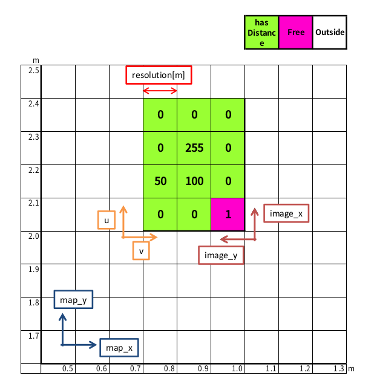
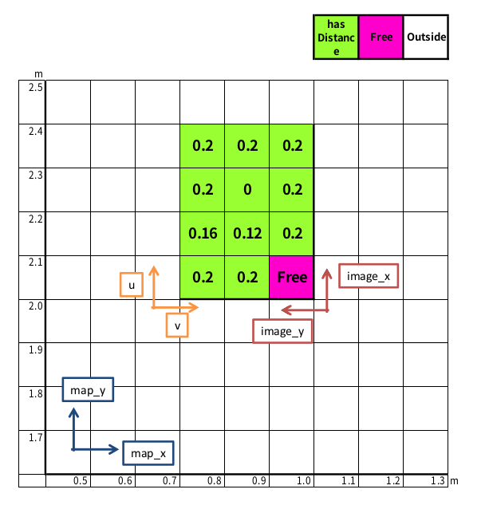

# tmc_pose_2d_lib
2次元の座標変換を扱うクラスのライブラリ。下記のクラスが実装されている  

- Point2D 2D点
- Rotation2D 2Dの回転の座標変換
- Pose2D 2Dの剛体座標変換
- DistanceMap ポテンシャルマップクラス。詳しくは後述

## DistanceMapクラスについて

### 座標系の説明
理解に必要なので解説する。

|  座標系名  |  原点位置、向き  |  単位  |
| ---- | ---- |  ---  |
|  `map`  |  なし(ここをグローバルな絶対基準とする)  |  m  |
|  `image`  |  地図画像の左下が原点、`nav_msgs::OccupancyGrid/origin`や`DistanceMap/origin_map_image`の値は`map->image`を指す  |  m  |
|  `image_uv`  |  地図画像左下が原点で、右方向が`u+`、上方向が`v+`、かつ整数値のみ持つ。  |  px  |


### DistanceMap/data について

型は、`std::vector<unsigned char> data`。`nav_msgs::OccupancyGrid/data`の情報を下記の値域に変換し格納している。  
画像(グリッド)の画素値に相当。画像の左下から右に順に値が入っている。  

値が1ならFree、0ならUnknown。255なら障害物を表す。  
それ以外なら、最寄りの障害物までの近さを示す値が入っている(値が大きいほど、障害物までの距離が近い)。  

元となる`nav_msgs::OccupancyGrid/data`の情報に、最寄りの障害物までの近さを示す値が元々入っている場合、  
`nav_msgs::OccupancyGrid`メッセージ内には後述する`potential_width`の情報が含まれていないので、DistanceMap::SetPotentialWidthで別途与える必要がある。  

元となる`nav_msgs::OccupancyGrid/data`の情報がFree、Unknown、障害物の三値のみで表現されており最寄りの障害物までの近さが入っていない場合、  
DistanceMap::InflateMapで`potential_width`の情報を与えれば、障害物からのポテンシャルを広げることができ、最寄りの障害物までの近さを示す値を付与できる。  

最寄りの障害物までの距離を求めるには、  
以下のように255(UCHAR_MAXの値)から引いたあとに正規化し、`potential_width`をかける。  
```c++
distance = static_cast<double>((UCHAR_MAX - val)) / static_cast<double>(UCHAR_MAX) * potential_width;
```


### 例
ここで示す参考データは`distance_map-test.cpp`で使われているものと同じである。
#### DistanceMapデータ
下記画像は、このような`DistanceMap`を表現したもの
```c++
DistanceMap map;
map.resolution() = 0.1;
map.width() = 4;
map.height() = 3;
map.potential_width() = 0.2;
map.origin_map_image() = Pose2d(1.0, 2.0, M_PI/2.0);
map.data() = std::vector<unsigned char>
    {1,   0,   0, 0
     0, 100, 255, 0,
     0,  50,   0, 0,};
```

#### 生値(`DistanceMap/data`)



#### 距離に変換したデータ


